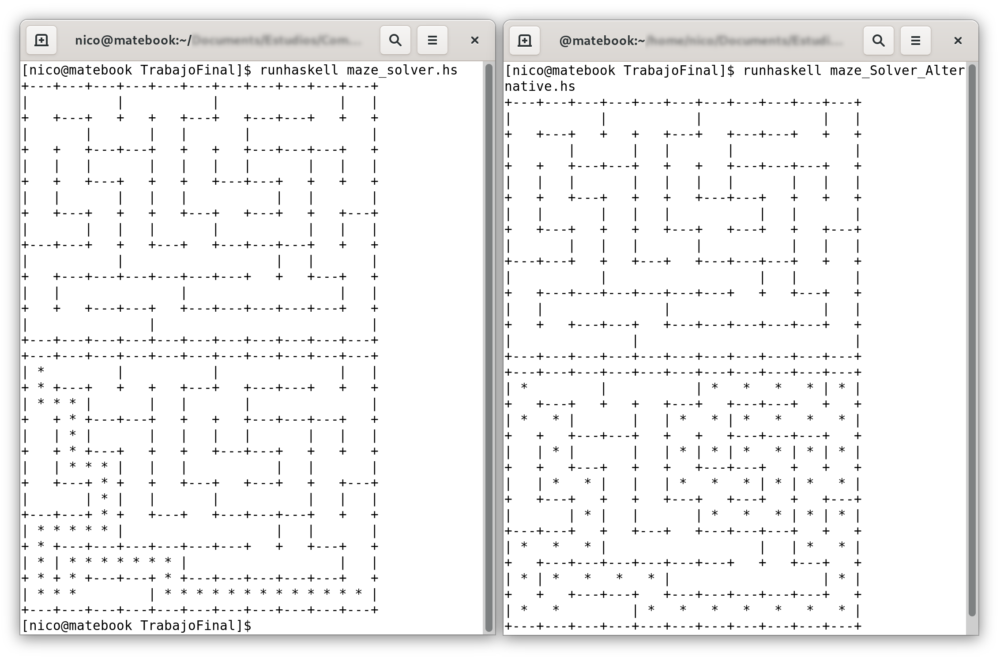

# Solucionador de laberintos en Haskell
*Estudio de su código e implentación de un método propio alternativo*

## Introducción
El proyecto consiste en el estudio de un algoritmo que resuelve un laberinto realizando un recorrido en anchura de este.
Posteriormente, hemos implementado un método de resolución alternativo basado en un algoritmo muy simple que consiste en ir siempre pegado a una pared del laberinto hasta salir de él.
> Código  que hemos usado  http://www.rosettacode.org/wiki/Maze_solving

#### Ejecución del algoritmo 

<p align="center">
        
</p>

## Desglose de varios métodos y operadores usados en el código.
 Para poder enteder el funcionamiento del programa, debemos aclarar previamente algunos conceptos.

### '_' - Underscore 
> https://typeclasses.com/underscore

Lo utilizamos para diferenciar funciones y/o variables, además de parámetros que no vamos a utilizar.

### Notación infija del operador div  
Usaremos ``10 `div` 2 `` en lugar de ``div 10 2 ``, es decir usaremos notación infija y no prefija para facilitar el entendimiento del código. 

### '$' - Dolar sign
> https://typeclasses.com/featured/dollar
> 
> https://stackoverflow.com/questions/940382/what-is-the-difference-between-dot-and-dollar-sign

Se utiliza para asociar funciones modificando la prioridad con la que estas se deben realizar. Por ejemplo, asociatividad de funciones con $ tiene la prioridad 0, en cambio, con el espacio tenemos el maximo (10). 

###  '!!' - Double exclamantion mark  
Devuelve el elemento situado en la posicíon indicada de un array.
`[1 0 2 3] !! 1` devuelve 0.

### splitAt 
Separa una cadena en dos a partir de la posición pasado por parámetro

```Haskell
    Prelude> splitAt 4 [1,2,3,4,5]    
    ([1,2,3,4],[5])  
    Prelude> splitAt 3 [1,2,3,4,5]    
    ([1,2,3],[4,5])
```    

### tail
Devuelve la misma lista sin el primer elemento
```Haskell
    Prelude> tail [1,2,3,4]
    [2,3,4]
```

### Data.Maybe
> https://stackoverflow.com/questions/18808258/what-does-the-just-syntax-mean-in-haskell/18809252
> 
> https://hackage.haskell.org/package/base-4.14.1.0/docs/Data-Maybe.html

Con esta libreria importamos todo lo necesario para trabajar con el tipo Maybe. Este es un tipo *opcional*, el cual nos permite encapsular una variable y devolverla cuando exista y en caso contrario devuelve *Nothing*. Es decir:
  - Nothing ⟶ cuando la variable que encapsula esta vacía.
  - Just valor ⟶ valor del tipo de la variable encapsulada. 

```Haskell
        data Maybe a = Just a
                    | Nothing
```

### fromMaybe
Función para desencapsular los valores Maybe, devuelve el valor del Just, en caso contrario devuelve la argumento pasado por parámetro.
```Haskell
    Prelude> fromMaybe "" (Just "Hello, World!")
    "¡Hola Mundo!"

    Prelude> fromMaybe "doesn't exists" Nothing
    "doesn't exists"
```

### let - in & where
>https://stackoverflow.com/questions/8274650/in-haskell-when-do-we-use-in-with-let/8274846

Nos permiten declarar variables auxiliares dentro de funciones para usarlas en su código. Usando `let - in` las declaramos antes de usarlas en `in`, en el caso de `where`, las utilizamos y luego especificamos su declaración.
#### Ejemplo de uso de `let - in`
```Haskell
    f :: s -> (a,s)
    f x =
        let y = ... x ...
        in  y
```

#### Ejemplo de uso de `where`
```Haskell
    f :: s -> (a,s)
    f x = y
        where y = ... x ...
```

### foldl
>http://zvon.org/other/haskell/Outputprelude/foldl_f.html 

Recibe una funcion, un elemento y una lista. Toma el segundo elemento y el primero de la lista y les aplica la función, luego, con esa salida de la función y el segundo elemento de la lista aplica de nuevo la función y así sucesivamente.

### Filter
Tiene dos parámetros de entrada, una función booleana y una lista. Devuelve una lista que contiene unicamente con los elementos que cumplen la función.
```Haskell
    Prelude> filter (>5) [1,2,3,4,5,6,7,8]
    [6,7,8]
```

### zip
Toma dos listas como parámetros de entrada, y devuelve una lista de parejas, en la que cada pareja está constituida por el elemento de la posición i-ésima de cada lista. Su funcionamiento sería parecido al de una cremallera donde ambas partes de la cremallera son las listas y la función se encarga de entrelazarlas.
```Haskell
    Prelude> zip [1,2,3] [9,8,7]
    [(1,9), (2,8), (3,7)]

    Prelude> zip [1,2,3,4,5] [9,8]
    [(1,9), (2,8)]
```

### '/=' - Not equal operator (≠)
 Devuelve true en caso de que los argumentos sean distintos y false en caso de que sean iguales.

### '@' - Signo de arroba.
> https://stackoverflow.com/questions/30326249/what-does-mean-in-haskell
> 
Ejemplo de uso: tenemos un argumento de entrada del tipo (Int, Int), en la declaración de la función utilizamos `pos@(x,y)` y este nos permite acceder a **x** o **y** posteriormente además de a **pos** que engloba el argumento completo.
```Haskell
    devuelveSuma :: (Int, Int) -> Int 
    devuelveSuma pos@(x,y) = x + y
```

### unlines
Crea una cadena a partir de una matriz de cadenas.
```Haskell
	Prelude> unlines ["aa", "bb", "cc", "dd", "ee"]
	"aa\n bb\n cc\n dd\n ee\n"
```

### lines
Crea una matriz de cadenas a partir de una cadena.
```Haskell
    Prelude> lines "aa\nbb\nbb"
    ["aa", "bb", "bb"]
```

### interact
> https://stackoverflow.com/questions/16799755/haskell-interact-function

interact recibe una función **(String -> String )** como argumento. Esperará una entrada por teclado, la pasará a esta función e imprimirá por pantalla la cadena devuelta por la función cuando esta termine, es decir, resuelve la entrada y salida de consola simultáneamente.

## Explicación de las funciones própias del código

### Average
Dado dos puntos, descritos como pareja de enteros, devuelve el punto promedio de ellos.
```Haskell
    average :: (Int, Int) -> (Int, Int) -> (Int, Int)
    average (x, y) (x_, y_) = ((x + x_) `div` 2, (y +  y_) `div` 2)
```

### noBlocked
Dado un laberinto, una posición posible (a partir de la actual) y la posición intermedia , devuelve **true** si la posicion intermedia está bloqueada por un muro y **false** en el caso contrario.
```Haskell
    notBlocked :: [String] -> ((Int, Int), (Int, Int)) -> Bool
    notBlocked maze (_, (x, y)) = ' ' == (maze !! y) !! x
```

### substitute
Recibe una lista, una posición de la lista y un elemento. La lista recibida es la fila donde se encuentra la posición actual. La función devuelve la lista con el elemento insertado en la posición pasada por parámetro.
```Haskell
    substitute :: [a] -> Int -> a -> [a]
    substitute orig pos el =
        let (before, after) = splitAt pos orig
        in before ++ [el] ++ tail after
```

### draw 
Dado un laberinto y una posicion. Devuelve el laberinto con la posición deseada marcada con un '*'.

```Haskell
    draw :: [String] -> (Int, Int) -> [String]
    draw maze (x, y) =
        let row = maze !! y
        in substitute maze y $ substitute row x '*'
 ```

### tryMoves
Dado un laberinto, una posición previa y una lista que contiene las posiciones potenciales (nuevas posiciones posibles) y sus respectivas posiciones intermedias. Devolverá un `Maybe` del laberinto, es decir, su `String` si el movimiento es posible o `Nothing` si no lo es.
```Haskell
    tryMoves :: [String]
            -> (Int, Int)
            -> [((Int, Int), (Int, Int))]
            -> Maybe [String]
    tryMoves _ _ [] = Nothing
    tryMoves maze prevPos ((newPos, wallPos):more) =
        case solve_ maze newPos prevPos of
            Nothing -> tryMoves maze prevPos more
            Just maze_ -> Just $ foldl draw maze_ [newPos, wallPos]
```

### solve_ 
Recibe un laberinto, una posicion nueva y una posición previa. Devuelve el laberinto solucionado o `Nothing` si no se puede solucionar. Mientras no esté resuelto (no estemos sobre la posición final) llamará a `tryMoves` pasándole los posibles movimientos a realizar en cada instante.

Cuando `tryMoves` termina, vuelve a llamar a `solve_` pasando la nueva posición como posición actual.
```Haskell
    solve_ :: [String] 
        -> (Int, Int) 
        -> (Int, Int) 
        -> Maybe [String]
    solve_ maze (2, 1) _ = Just maze
    solve_ maze pos@(x, y) prevPos =
        let newPositions = [(x, y - 2), (x + 4, y), (x, y + 2), (x - 4, y)]
            notPrev pos_ = pos_ /= prevPos
            newPositions_ = filter notPrev newPositions
            wallPositions = map (average pos) newPositions_
            zipped = zip newPositions_ wallPositions
            legalMoves = filter (notBlocked maze) zipped
        in tryMoves maze pos legalMoves
```

`tryMoves` y `solve_` actúan en conjunción de la siguiente manera:
Mientras no hallamos llegado a la posición final (2,1), calculamos las posibles movimientos desde la posición actual y los pasaremos a `tryMoves`. Si hay algún movimiento posible, se llamará a `solve_` ( desde `tryMoves`) con la posición que resulta de este movimiento. En este momento, `solve_` devuelve un `Maybe` indicando, si en esta nueva posición existen nuevas movimientos posibles o no. En el caso de que existan, se pinta y se devuelve el laberinto, en caso contrario, `tryMoves` seguirá probando con los siguientes movimientos posibles.

### solve 
Se encarga de controlar y llamar a `solve_`. 
Recibe como entrada desde el main, el laberinto en forma de string.
Su salida será `Maybe[String]`, esto es, el laberinto resuelto en caso de que se haya encontrado solución o nothing en caso contrario.
Además calcula la posición inicial del laberinto tomando sus bordes como referencia.
```Haskell
    solve :: [String] -> Maybe [String]
    solve maze = solve_ (draw maze start) start (-1, -1)
    where
        startx = length (head maze) - 3
        starty = length maze - 2
        start = (startx, starty)
```
### main 
Aplica `interact` ( explicado previamente) a `main_`, utilizando la funcion `lines` para dividir el laberinto en una matriz de strings para su tratamiento y revirtiendo el proceso con `unlines` al obtener el resultado. `interact` captura la entrada por consola y muestra el resultado cuando el proceso a terminado.
```Haskell
    main =
        let main_ = unlines . fromMaybe ["can_t sol ve"] . solve . lines
        in interact main_
```

## Implementación de un método alternativo de resolución de laberintos

Después de estudiar el código anterior, nos propusimos la tarea de implementar nuestro propio método para resolver este tipo de problemas usando algunas de las herramientas y funciones que nos ha aportado el código anterior (es el caso de las funciones `average`, `notBlocked`, `substitute` y `draw`).

La idea que hemos seguido para plantear este algoritmo de resolución de laberintos, es muy sencilla. Esta consiste en avazanzar siempre pegado a la pared de la derecha (en nuestro caso). De esta forma se puede resolver cualquier laberinto. En el peor caso se recorrerá el laberinto al completo pero siempre hallará una solución si esta existe.

Para ello tenemos que tener en cuenta la orientación y la posición actual en cada momento, ya que la pared que estamos siguiendo estará arriba, abajo, a la izquierda o a la derecha de la posición actual en función de la orientación. Indicaremos la orientación con los números 0 (a la derecha), 1 (hacia arriba), 2 (a la izquierda) y 3 (hacia abajo). 

### posPosibles 
Dada nuestra posición y nuestra orientación actual, genera los posibles movimientos ordenados por prioridad. La prioridad de movimiento es la siguiente:
  1. Girar a la derecha (con respecto a nuestra orientación).
  2. Seguir de frente.
  3. Girar a la izquierda.
  4. Retroceder.
   
```Haskell
    posPosibles :: (Int, Int) -> Int -> [(Int, Int)]
    posPosibles pos@(x,y) ori = 
        case ori of 
            0 -> [(x + 4, y), (x, y - 2), (x - 4, y), (x, y + 2)]
            1 -> [(x, y - 2), (x - 4, y), (x, y + 2), (x + 4, y)]
            2 -> [(x - 4, y), (x, y + 2), (x + 4, y), (x, y - 2)]
            3 -> [(x, y + 2), (x + 4, y), (x, y - 2), (x - 4, y)]

```

### move
Recibe el laberinto, la posición hacia donde nos queremos mover y la posición intermedia. 
Esta función vuelve a llamar a `check_` con el laberinto actualizado y la nueva posición actual. 
```Haskell
    move :: [String] -> ((Int, Int),(Int, Int)) -> Int -> [String] 
    move maze (newPos, wallPos) ori = 
        check_ (draw maze newPos) newPos ori
```

### check_
La función recibe el laberinto, la posición actual y el elemento que nos indica la orientación que tenemos.
Llama a `posPosibles` recibiendo de ellas los posibles movientos y calcula la posición de los muros respectivos a estos posibles movimientos. Comprueba los que no están bloqueados, y selecciona el siguiente movimiento siguiendo el orden de prioridad descrito previamente.
```Haskell
    check_ :: [String] -> (Int, Int) -> Int -> [String]
    check_ maze (2, 1) _ = maze 
    check_ maze pos ori 
        | notBlocked maze (head zipped) = move maze (head zipped) ((ori + 3) `mod` 4)
        | notBlocked maze (zipped !! 1) = move maze (zipped !! 1) ((ori + 0) `mod` 4)
        | notBlocked maze (zipped !! 2) = move maze (zipped !! 2) ((ori + 1) `mod` 4)
        | notBlocked maze (zipped !! 3) = move maze (zipped !! 3) ((ori + 2) `mod` 4)
        where
            newPositions = posPosibles pos ori
            wallPositions = map (average pos) newPositions
            zipped = zip newPositions wallPositions

```

### check
Se encarga de controlar y llamar a `check_`. 
Recibe como entrada desde el main, el laberinto en forma de string.
Su salida será el laberinto resuelto en forma de `[String]`.
Además calcula la posición inicial del laberinto tomando sus bordes como referencia.
```Haskell
    check :: [String] -> [String]
    check maze = check_ (draw maze start) start 0
        where
            startx = length (head maze) - 3
            starty = length maze - 2
            start = (startx, starty)

```

### main
Obtiene la entrada por consola usando `interact` y muestra el laberinto correctamente formateado al finalizar `check`.
```Haskell
    main =
        let main_ = unlines . check . lines
        in interact main_
```
#### Comparación de ejecución de los dos algoritmos
<p align="center">
        
</p>

> En la imagen podemos observar el funcionamiento del algoritmo original ( a la izquierda) y el nuestro ( a la derecha).
 
 ## Instrucciones de ejecución
 Ejecutar el código desde el intérprete o `WinHugs` da problemas con la entrada de texto. Lo mejor es ejecutar el programa directamente con la herramienta `runHaskell`, la cual forma parte del paquete `Haskell-Platform` el cual puede ser instalado fácilmente en sistemas Linux directamente desde los repositorios o en Windows siguiendo los siguientes pasos.
 1. Partimos de la base que vamos a ejecutarlo en Visual Studio Code, por lo que debemos tenerlo instalado.
 2. Accedemos a los paquetes instalados y buscamos el paquete Haskell:

    Name: Haskell 

    Id: haskell.haskell

    Description: Haskell language support powered by the Haskell Language Server and ghcide
    
    Version: 1.2.0
    
    Publisher: Haskell
    
    VS Marketplace Link: https://marketplace.visualstudio.com/items?itemName=haskell.haskell
 
 3. Una vez instalado Haskell en nuestro sistema, abrimos una terminal en la carpeta donde se encuentra los archivos *.hs*.
 4. Cargamos nuestro fichero *maze_Solver.hs* o *maze_Solver_Alternative.hs*. Usando `runhaskell`
```Haskell
    runHaskel maze_Solver.hs
```
5. El programa esperará que introduzcamos el laberinto. Copiamos cualquiera de los que se incluyen en el archivo *maze_templates.txt* y lo pegamos en la terminal. 
Ahora tendremos que indicar el final de entrada: 
-  En GNU/Linux usando `cntrl+D` 
-  En Windows debemos pulsar `ctrl+Z` seguido de `Enter`, y de nuevo `ctrl+Z` seguido de `Enter`.

6. Finalmente el programa mostrará el laberinto resuelto.

---
 
📋 Proyecto realizado por **Ricardo Manuel Ruiz Díaz** & **Nicolás Magro Cruzado** para las prácticas de *Programación Funcional* de la [Universidad de Huelva](http://www.uhu.es/etsi/).


